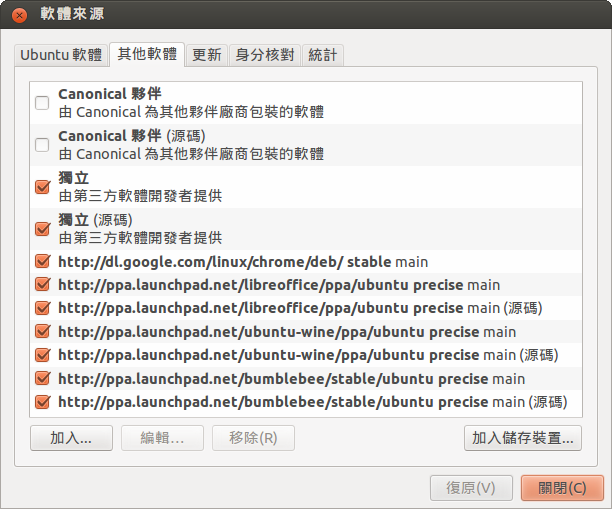
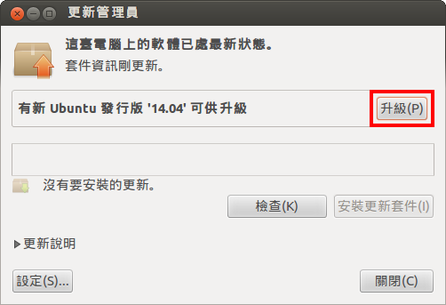

# 打造一個 Windows+Ubuntu 的雙系統 投影片
## 原始作者 Original author
宋岡哲(@Explorer09)
原始作品網站：[https://dl.dropboxusercontent.com/u/70170658/ubuntu-dual-boot](https://dl.dropboxusercontent.com/u/70170658/ubuntu-dual-boot)

## 授權條款 License
創用 CC-BY-SA 4.0 授權條款

## 第1章：下載Ubuntu及需要的軟體
下載投影片：[PDF] [ODP] [PPT]

* Ubuntu 光碟映像檔
* EaseUS Partition Master

## 第2章：分割硬碟給Ubuntu
下載投影片：[PDF] [ODP] [PPT]

## 第3章：安裝Ubuntu 12.04 LTS
下載投影片：[PDF] [ODP] [PPT]

## 第4章：與Windows分享檔案
下載投影片：[PDF] [ODP] [PPT]

* 在 Ubuntu 上存取 Windows 檔案
* 設定檔案系統標籤
* 在 Windows 上讀 Ubuntu 檔案 (Ext2Fsd)
* 網路上的芳鄰與 Samba

## 第5章：Ubuntu之後可灌的常用軟體
下載投影片：[PDF] [ODP] [PPT]

* ubuntu-restricted-extras (codecs, Flash, MS fonts, RAR)
* Google Chrome
* Skype
* gcin/hime 輸入法
* sudo apt-get 的意思，以及 PPA
* LibreOffice
* 顯卡驅動程式（包括雙顯卡支援）
* Wine
* 免費中文字型

## 第6章：當機生存指南
下載投影片：[PDF] [ODP] [PPT]

* Ubuntu 的「系統監控」（工作管理員）
* 文字模式和 top 的使用
* 如何重啟圖形介面

## 第7章：加入社群
下載投影片：[PDF] [ODP] [PPT]

* Ubuntu 的論壇與網路社團
* 提問與找資料的方法
* 認識不同的 Ubuntu 發行版

## 附錄A：雙系統常見問題
下載投影片：[PDF] [ODP] [PPT]

* 如何設定預設開機的作業系統
* 重灌 Windows 後，如何開機到 Ubuntu

在第5章裡面，你總共會新增4個套件庫來源。

如果你要從 Ubuntu 12.04 升級到 14.04 ，可以從「更新管理員」裡面按「升級」來完成。這個升級按鈕會在 7 月 24 日， Ubuntu 14.04.1 發行時出現。

如果要透過命令列升級，請用 "sudo do-release-upgrade" 。

## Source

* 原始螢幕擷圖
* 投影片樣板 (ODP)

## 如何貢獻本專案 How to contribute this project
* 發現問題的話請到[本專案的問題追蹤系統(issue tracker)](https://github.com/Vdragon/ubuntu-dual-boot/issues)建檔回報
* 要貢獻內容的話歡迎克隆(clone)本專案的版本倉庫至您的電腦中，建立新的 Git 分支(branch)完成編輯後提交(commit)為一個新版本推送到您的 GitHub 版本倉庫再跟我們發出拉取請求(pull request)
